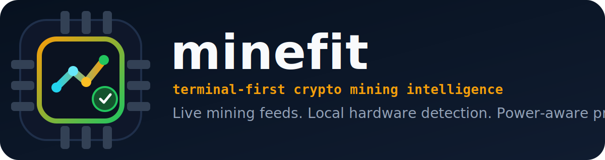
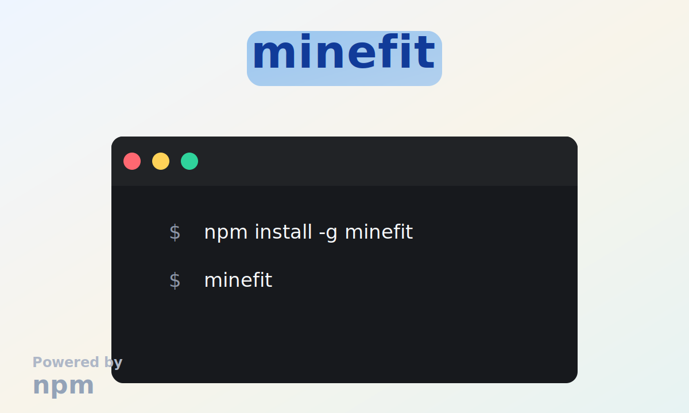

  <a href="https://github.com/Barkeydog/minefit">
    <picture>
      <source media="(prefers-color-scheme: dark)" srcset="assets/github/logo-dark.svg">
      <source media="(prefers-color-scheme: light)" srcset="assets/github/logo-light.svg">
      
    </picture>
  </a>

  <h3>Terminal-first crypto mining comparison for the hardware you actually have.</h3>

  
  
  
  
  
  

  
  
  
  
  

 

`minefit` is a mining-focused fork of `llmfit` that turns a fast terminal UI into a live mining decision surface. It detects the local CPU and GPU, estimates electricity from the current location, pulls live coin and market data, and ranks coins and methods against real power drag instead of fantasy hashrates.

The goal is operational usefulness. `minefit` is built to answer a narrower question than a generic portfolio tracker: *what can this machine mine, what does power do to the economics, and what method looks best right now?*

> [!NOTE]
> The current default scope is the local system only. `minefit` detects the CPU and GPU on the current machine and ranks mining setups against that hardware automatically.

---

## Quick Start

## Why minefit

- Local-first by default. The app models the CPU and GPU on the current machine instead of asking the user to assemble a fake rig.
- Power-aware ranking. Electricity is part of the default math, including utility-aware California TOU modeling and U.S. state fallback.
- Live mining data. Rankings are fed by WhatToMine, Hashrate.no, MiningPoolStats, Coinbase spot, and discovery catalog enrichment.
- Multi-surface workflow. The same ranking engine is available as a full TUI, a classic terminal table, and a JSON output path.
- Realism over hype. Methods include fees, stale/reject drag, uptime assumptions, service costs, eligibility checks, and solo variance.

## What It Models

- Local CPU and GPU detection, including backend hints and memory context.
- Utility-aware electricity estimation from the current location, with explicit manual overrides.
- Tier-one mining rows backed by live telemetry and benchmarked algorithm support.
- Discovery coverage for the long tail of assets, so catalog assets do not vanish when feed quality drops.
- GPU, CPU, and ASIC-oriented techniques across pool, solo, hosted, and efficiency-focused strategies.
- Coin eligibility checks for backend fit, VRAM pressure, benchmark coverage, and algorithm support.
- Solo variance signals including p50 and p90 monthly outcomes plus zero-block risk.
- Persistent app state and cached startup snapshots under `~/.config/minefit/`.

## Ranking Model

`minefit` blends market opportunity with operational drag. A row score is influenced by:

- gross daily revenue
- electricity cost
- pool fees and stale-share drag
- runtime and uptime assumptions
- service cost for hosted strategies
- liquidity and confidence penalties
- trend and volatility adjustments
- fit between the coin, method, and available hardware

This means a row can appear with a negative net return if it is technically possible but economically weak. That is intentional. For example, BTC can show up on CPU or GPU through software SHA256 paths even though those rows are usually not viable in practice.

## Data Sources

`minefit` currently draws on a mix of live mining, benchmark, and market sources:

- [WhatToMine](https://whattomine.com/coins.json)
- [Hashrate.no](https://www.hashrate.no/)
- [MiningPoolStats](https://miningpoolstats.stream/)
- [Coinbase spot prices](https://www.coinbase.com/)
- [CoinPaprika discovery catalog](https://docs.coinpaprika.com/api-reference/coins/list-coins)

When a source is unavailable or rate-limited, cached snapshots are used so startup stays fast and the app degrades cleanly instead of failing hard.

