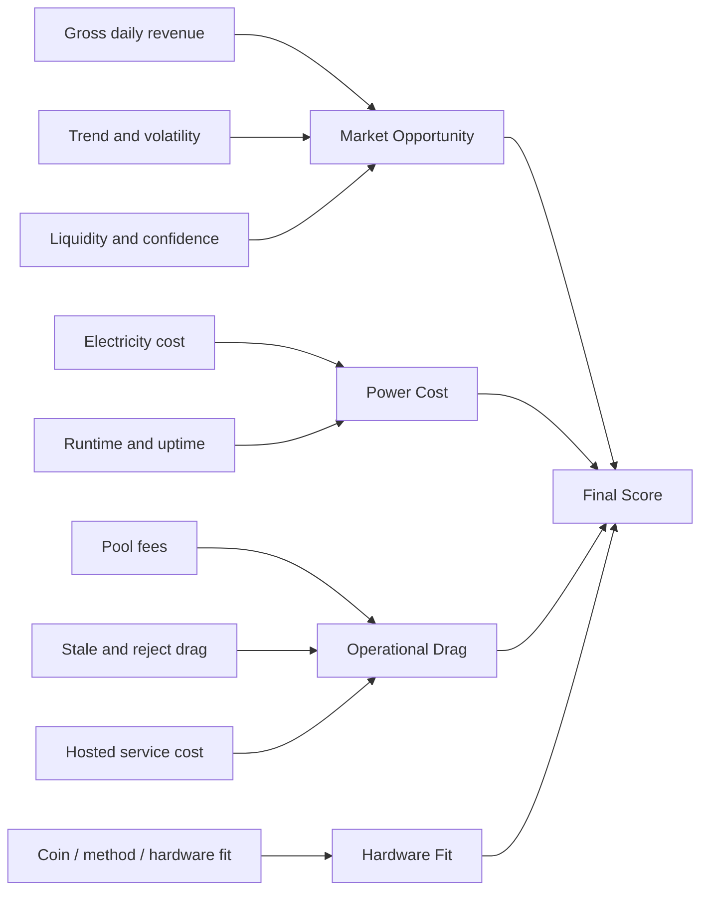
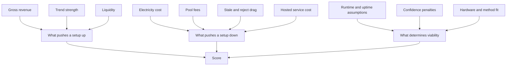
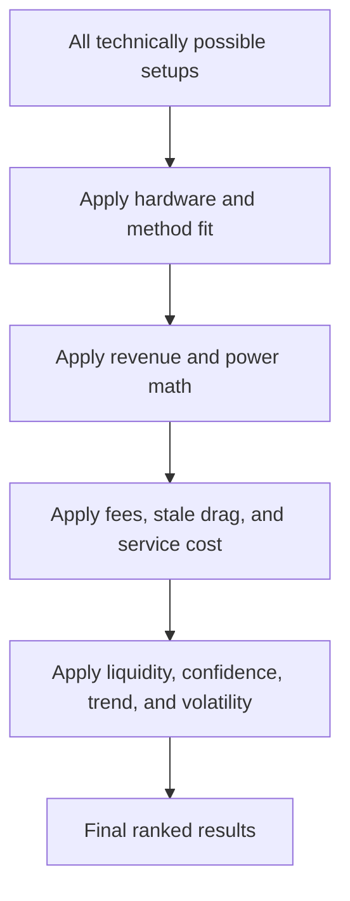
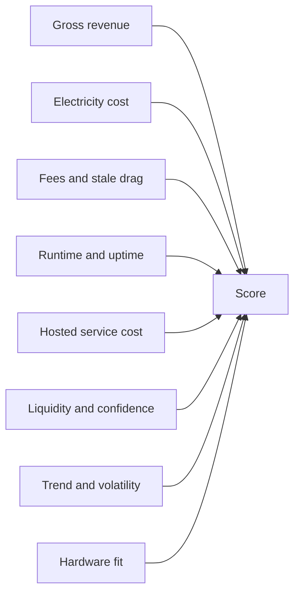
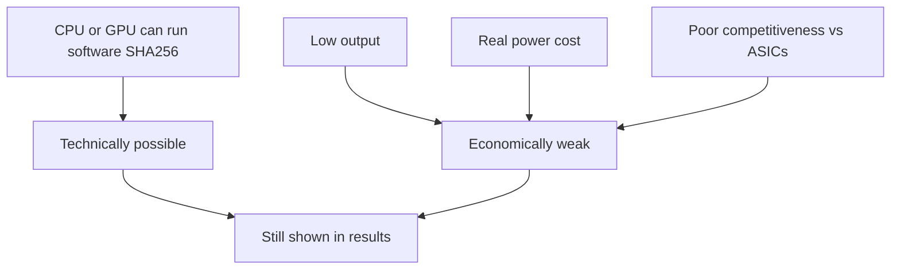

# Ranking Model Diagram Experiments

This file explores alternatives to the current `Ranking Model` section in `README.md`.

Current problem:
- the text is accurate
- the list is clear
- but it reads like raw documentation instead of a quick mental model

The goal of these variants is to explain:
- what feeds the score
- why profitability is not the only factor
- why technically possible rows can still rank poorly

## Variant 1: Simple flowchart

Why it works:
- easiest to understand
- good README fit
- shows that score is multi-input, not just profit

Weakness:
- still a little abstract

## Variant 2: Positive vs negative forces

Why it works:
- strong mental framing
- makes the tradeoffs obvious

Weakness:
- less literal than the underlying ranking pipeline

## Variant 3: Funnel diagram

Suggested supporting sentence:

> A setup can survive the technical filter and still rank badly once power, fees, confidence, and market quality are applied.

Why it works:
- very clean
- explains why “possible” does not mean “good”

Weakness:
- hides the specific factors unless paired with short text

## Variant 4: Score equation map

Suggested supporting sentence:

> `minefit` scores a setup by balancing raw earnings against power, execution drag, market quality, and hardware fit.

Why it works:
- closest to the current list
- very compact

Weakness:
- visually flatter than the stronger concept diagrams

## Variant 5: Why BTC can appear but still rank badly

Suggested supporting sentence:

> `minefit` does not hide technically valid setups just because they are bad bets. A CPU or GPU BTC path can appear, but rank poorly for economic reasons.

Why it works:
- directly explains the most confusing example
- makes the design philosophy obvious

Weakness:
- too specific to replace the whole section by itself

## Recommendation

Best overall:
- **Variant 2** if you want the clearest conceptual explanation
- **Variant 3** if you want the cleanest README presentation

Best combined solution:
- use **Variant 3** as the diagram
- keep one short paragraph underneath explaining that technically possible rows can still rank badly

## Suggested replacement

`minefit` blends market opportunity with operational drag. A setup can survive the technical filter and still rank badly once power, fees, confidence, and market quality are applied. That is intentional. For example, BTC can show up on CPU or GPU through software SHA256 paths even when those setups are not economically viable in practice.
