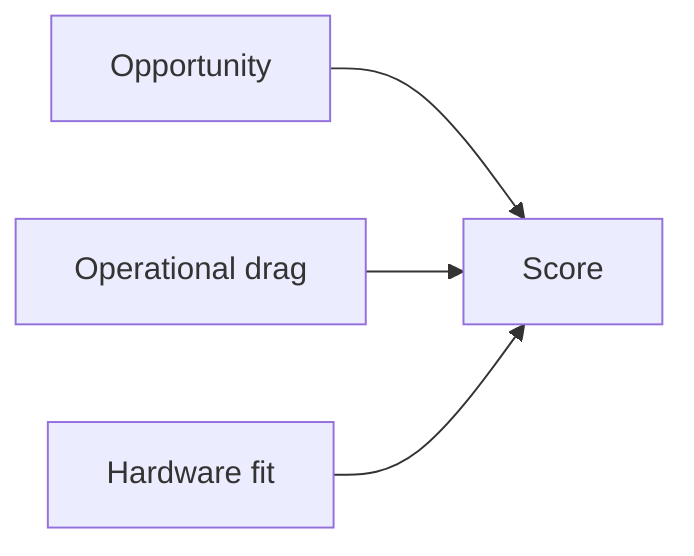
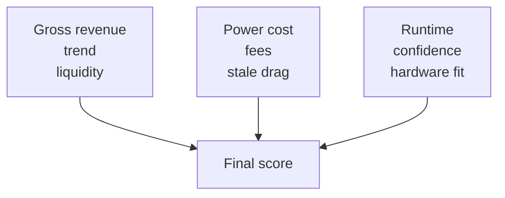
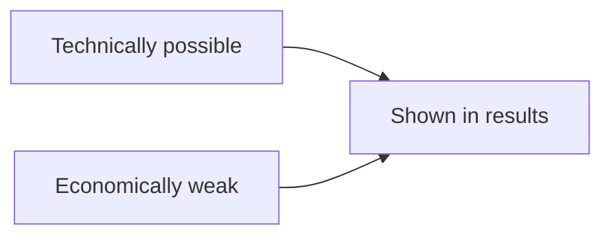
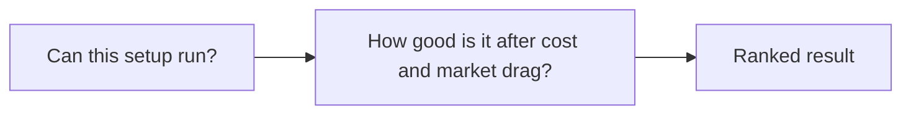
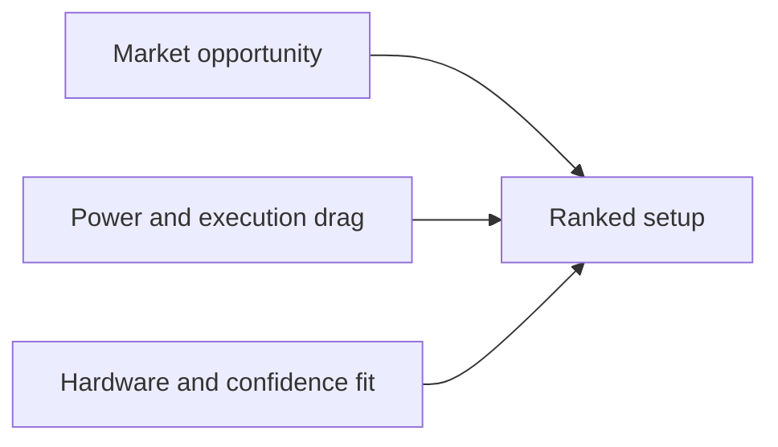

# Ranking Model Mermaid Experiments

These are smaller, more professional Mermaid options intended for README use.

The goal is to explain the scoring model without producing a giant diagram.

## Variant A: Compact pipeline

Suggested caption:

> `minefit` scores setups by balancing market opportunity against operational drag and hardware fit.

Why this works:
- very compact
- clean in a README
- good if the sentence underneath carries the detail

## Variant B: Balanced inputs

Why this works:
- still compact
- includes the actual factor families
- feels more complete than Variant A

Why it is better than the original:
- fewer nodes
- less visual noise
- still tells the story

## Variant C: Technical vs economic

Suggested caption:

> A setup can be technically valid and still rank poorly. `minefit` keeps those rows visible instead of pretending they do not exist.

Why this works:
- directly explains the “BTC on CPU/GPU” confusion
- very small and very readable

Weakness:
- too narrow to replace the entire section alone

## Variant D: Two-stage model

Suggested caption:

> `minefit` first checks whether a setup is viable on the available hardware, then ranks it using cost, market quality, and execution drag.

Why this works:
- strongest explanatory structure
- clean mental model
- stays small enough for a README

## Variant E: Recommended polished Mermaid

Suggested supporting text:

> `minefit` blends market opportunity with operational drag. A setup can appear in results and still rank poorly once power, fees, confidence, and hardware fit are applied.

## Recommendation

Best Mermaid option: **Variant E**

Why:
- compact
- polished
- readable in GitHub
- broad enough to replace the current section

If you want more explanation under it, pair it with one short sentence about BTC or technically valid but economically weak setups.
