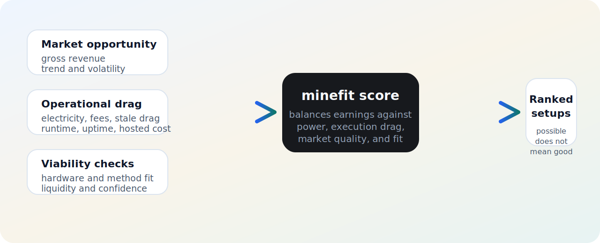

# Ranking Model Visual Experiments

This is a smaller replacement for the oversized Mermaid draft.

## Goal

Explain the ranking model in a way that feels:
- professional
- compact
- README-friendly
- visually consistent with the install card

## Option A: Single SVG card

Why this is stronger:
- compact enough for a README
- more polished than raw Mermaid
- easier to scan than a long factor list
- visually consistent with the rest of the repo assets

## Option B: SVG card + one sentence

Use the SVG, then one short line:

> `minefit` ranks setups by balancing market opportunity against power cost, execution drag, market quality, and hardware fit.

## Option C: SVG card + BTC note

Use the SVG, then one short explanatory note:

> A setup can be technically valid and still rank poorly. For example, BTC may appear on CPU or GPU through software SHA256 paths even when it is not economically viable.

## Recommendation

If this goes into the README, the cleanest version is:
- the SVG card
- one short follow-up sentence

That gives you the explanation without turning the README into a wall of framework text.
